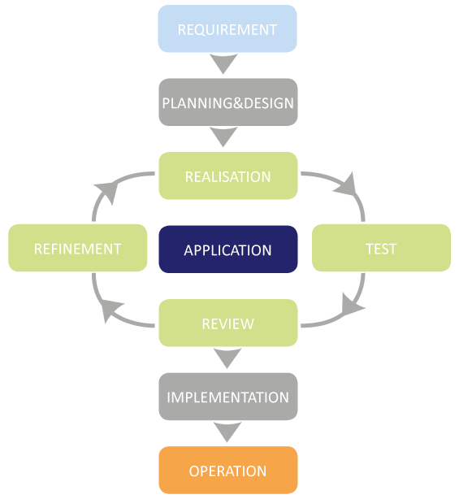

# T2A1 Workbook

## Submitted by: Wilson Esmundo

### Q1. Describe the architecture of a typical Rails application

Rails architecture has the following features: 

- Model-View-Controller architecture. 
   

  - Model layer acts as the logic of the application and the rules to control the data. They are used to manage the interaction with their corresponding representation in the database. The Models represent the information in the database and do the appropriate validations. 
     
  - The view is the front-end of the application, representing the user interface. The views are HTML files that uses embedded Ruby code. It is fairly simple (loops and conditionals). It is only used to display data to the user in the form of views. Views are used to provide the data to the browsers that requested the web pages. Views can server content in several formats, such as HTML, PDF, XML, RSS and more. 
     
  - Controllers acts as the brains and interact with models and views. The incoming requests from the browsers are processed by the controllers, which process the data from the models and pass it to the views for presentation. 
     

- Representational State Transfer (REST) for web services. 
  - Stands for Representational State Transfer. It is an alternative to web services, such as SOAP and WSDL. It relies in the HTTP protocol for all the CRUD operations: create, read, update and delete. RESTful web services are appropriated when the web services are completely stateless with limited bandwidth. 
     
- Supports the major databases. 

  - It supports MySQL, Oracle, MS SQL Server, PostgreSQL, IBM DB2, and more. 

- Open-source server side scripting language.
- Convention over configuration
- Scripts generators to automate tasks.
- Use of YAML machine, which is a human-readable data serialization format.  

### Q2. Identify a database commonly used in web applications (including Rails) and discuss the pros and cons of this database

| Database |            Pros            | Cons            |
| :------- | :------------------------: | :-------------- |
| SQLite   |        Lightweight         | Low Traffic     |
|          |     Better Performance     | Restricted Size |
|          |   No Installation Needed   |                 |
|          |          Reliable          |                 |
|          |          Portable          |                 |
|          |         Accessible         |                 |
|          | Reduce Cost and Complexity |                 |
|          |                            |                 |

- SQlite is a very popular database which has been successfully used with on disk file format for desktop applications like version control systems, financial analysis tools, media cataloging and editing suites, CAD packages, record keeping programs etc. It is the default one if you install ruby on rails. It is a very light weighted database so, it is easy to use it as an embedded software with devices like televisions, Mobile phones, cameras, home electronic devices, etc. It has a quick read and write operation to access those database. It only loads the data which is needed, rather than reading the entire file and hold it in memory and if you edit it only overwrite the parts you have changed. It doesn't require and installation or configuration. It updates your content continuously and is less bugs prone rather than custom written file I/O codes and there queries are smaller than equivalent procedural codes so, chances of bugs are minimal. It can be used with all programming languages without any compatibility issue. It is accessible through a wide variety of third-party tools and its content is more likely to be recoverable if it has been lost. It can be easily extended in in future releases just by adding new tables and/or columns. It also preserve the backwards compatibility. Its only disadvantage were its used to handle low to medium traffic HTTP requests and size is restricted to 2GB in most cases. 
   

### Q3. Discuss the implementation of Agile project management methodology

- The agile development approach is designed to cope with the complexity of modern projects and to allow these projects to be designed in a more flexible manner. Agile development is able to take change requests into account to a much greater extent and respond flexibly to new requirements that only emerge when the project is underway. With this in mind, the set of objectives is not completely and precisely planned at the beginning of the project life span and developed over a long period of time; instead, the individual customer requirements for the software solution are worked on in incremental, interactive cycles. 
   
  
   
- Implementation of Agile Project Management 
   

  - Set your vision with a strategy meeting 

    - At the beginning of a new Agile project, you need to define a clear business need or vision that your project is addressing. In essence, you need to answer why you’re doing what you’re setting out to do? It’s big picture stuff, but this is the core belief that you’ll refer back to as you build. 

  - Build out your product roadmap  

    - Once your strategy has been validated it’s time for the product owner to translate that vision into a product roadmap. This is a high-level view of the requirements for your project with a loose timeframe for when you will develop each of them. The ‘loose’ part here is important. You’re not spending days or weeks planning out every step, but simply identifying, prioritizing, and roughly estimating the effort each piece of your product will take on the way to making a usable product. 

    
     

  - Get amped up with a release plan 
    - Now that we’ve got a strategy and a plan it’s time to set some tentative timelines. At this stage, the product owner creates a high-level timetable for the release of working software. Because Agile projects will have multiple releases, you’ll want to prioritize the features needed to get you to launch first. 
  - It’s time to plan out your sprints

    - It’s time to move from the macro to the micro view as the product owner and development team plan “sprints”—short cycles of development in which specific tasks and goals will be carried out. A typical sprint lasts between 1–4 weeks and should remain the same length throughout the entire project as this enables teams to plan future work more accurately based on their past performance. 

  - Keep your team on track with daily standups 

    - Throughout every sprint you need opportunities to make sure no roadblocks are creeping up and getting in the way of completing your goals on time. That’s where the daily meeting, or Standup in Agile-speak, comes in. A standup is a daily meeting where your team comes together to discuss important accomplishments and roadblocks. 

  - Sprint’s done? It’s time for a review

    - The key here is to check your initial plan to make sure that all requirements were met. As the product owner, it’s your choice to accept or refuse certain functionalities. If something went wrong, ask why? How can you adjust the next sprint so your team can hit their targets? Agile is all about continuous learning and iterations, and this means on your processes as well as your product.  

  - What’s next? Decide what to focus on in your sprint retrospective 
    - For Agile project management to work, you need to have a clear next step after each step. This is determined during your sprint retrospective. Once a sprint has been completed and features have been shown off, it’s time to decide what work gets done next. 

### Q4. Provide an overview and description of a standard source control process.

### Reference:

- Ruby on Rails Architectural Design, Adrian Mejia, https://adrianmejia.com/ruby-on-rails-architectural-design/ 
- SQLite Advantages (JavaTpoint), https://www.javatpoint.com/sqlite-advantages-and-disadvantages  
- Agile Implementation Methodology, CosmoConsult, https://www.cosmoconsult.com/business-and-it-consulting/implementation-methodologies-and-implementation-consulting/agile-implementation-methodology/  
