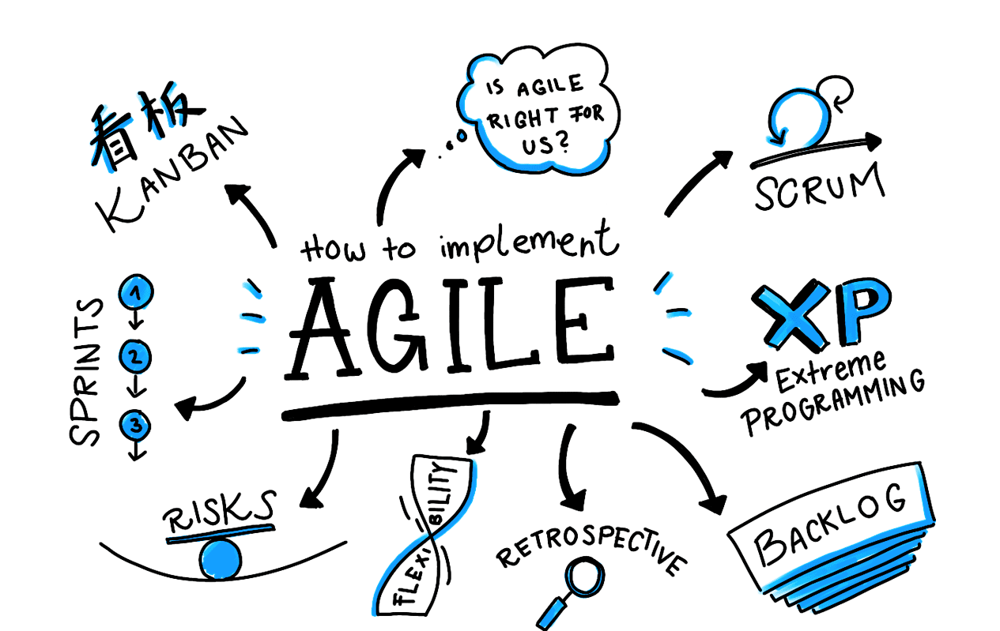
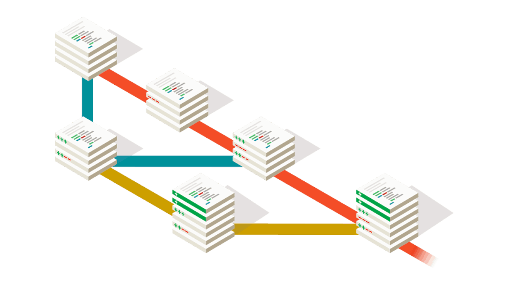
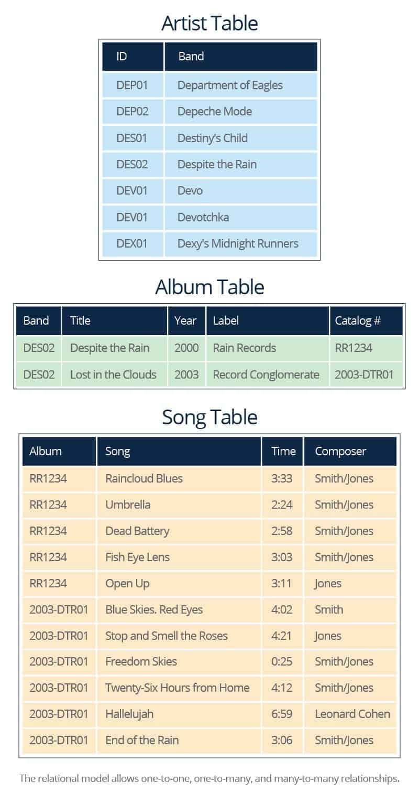
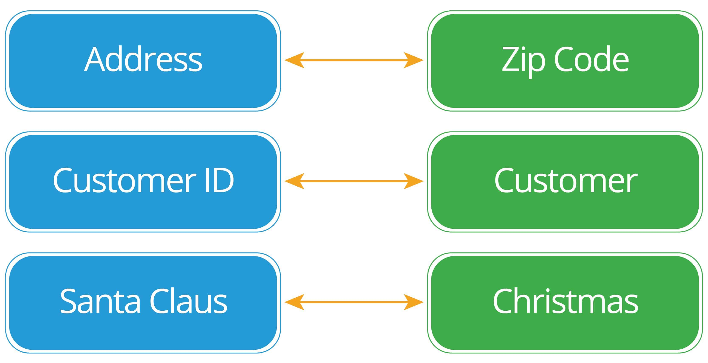
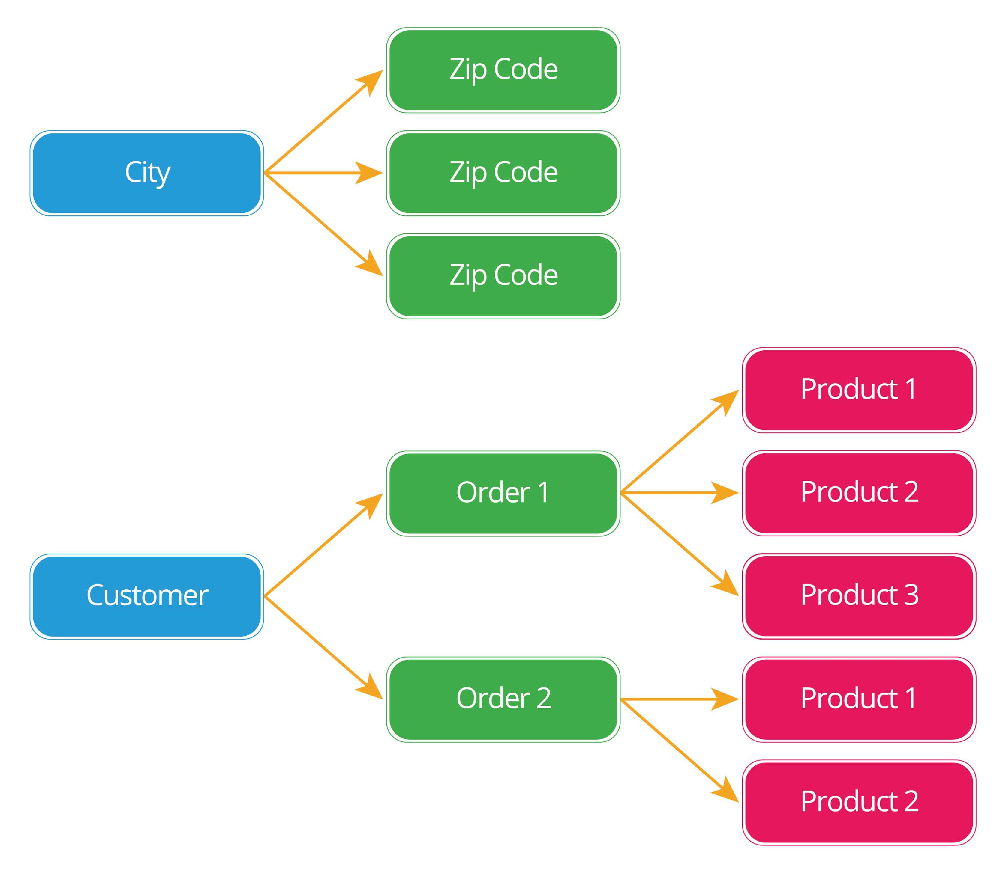
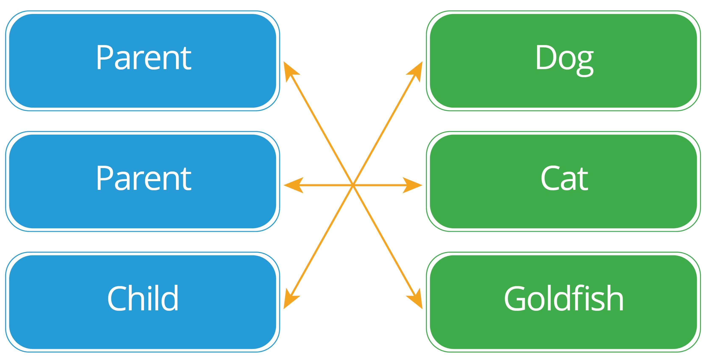

# T2A1 Workbook

## Submitted by: Wilson Esmundo

To view in GitHub  
Please click [here](https://github.com/charliegucci/T2A1)

### Q1. Describe the architecture of a typical Rails application

---

 

Rails architecture has the following features: 

| Ruby on Rails Architecture   | Details                                                                                                                                                                                                                                                                                                                                                                                                                   |
| :--------------------------- | :------------------------------------------------------------------------------------------------------------------------------------------------------------------------------------------------------------------------------------------------------------------------------------------------------------------------------------------------------------------------------------------------------------------------ |
| Model                        | Model layer acts as the logic of the application and the rules to control the data. They are used to manage the interaction with their corresponding representation in the database. The Models represent the information in the database and do the appropriate validations                                                                                                                                              |
| View                         | The view is the front-end of the application, representing the user interface. The views are HTML files that uses embedded Ruby code. It is fairly simple (loops and conditionals). It is only used to display data to the user in the form of views. Views are used to provide the data to the browsers that requested the web pages. Views can server content in several formats, such as HTML, PDF, XML, RSS and more. |
| Controller                   | Controllers acts as the brains and interact with models and views. The incoming requests from the browsers are processed by the controllers, which process the data from the models and pass it to the views for presentation.                                                                                                                                                                                            |
| REST for Web Services        | Stands for Representational State Transfer. It is an alternative to web services, such as SOAP and WSDL. It relies in the HTTP protocol for all the CRUD operations: create, read, update and delete. RESTful web services are appropriated when the web services are completely stateless with limited bandwidth.                                                                                                        |
| Supports the major databases | It supports MySQL, Oracle, MS SQL Server, PostgreSQL, IBM DB2, and more.                                                                                                                                                                                                                                                                                                                                                  | Open-source server side scripting language. |
|                              | Open-source server side scripting language.                                                                                                                                                                                                                                                                                                                                                                               |
|                              | Convention over configuration                                                                                                                                                                                                                                                                                                                                                                                             |
|                              | Scripts generators to automate tasks.                                                                                                                                                                                                                                                                                                                                                                                     |
|                              | Use of YAML machine, which is a human-readable data serialization format.                                                                                                                                                                                                                                                                                                                                                 |

 

### Q2. Identify a database commonly used in web applications (including Rails) and discuss the pros and cons of this database

---

| Database |            Pros            | Cons            |
| :------- | :------------------------: | :-------------- |
| SQLite   |        Lightweight         | Low Traffic     |
|          |     Better Performance     | Restricted Size |
|          |   No Installation Needed   |                 |
|          |          Reliable          |                 |
|          |          Portable          |                 |
|          |         Accessible         |                 |
|          | Reduce Cost and Complexity |                 |
|          |                            |                 |

- SQlite is a very popular database which has been successfully used with on disk file format for desktop applications like version control systems, financial analysis tools, media cataloging and editing suites, CAD packages, record keeping programs etc. It is the default one if you install ruby on rails. It is a very light weighted database so, it is easy to use it as an embedded software with devices like televisions, Mobile phones, cameras, home electronic devices, etc. It has a quick read and write operation to access those database. It only loads the data which is needed, rather than reading the entire file and hold it in memory and if you edit it only overwrite the parts you have changed. It doesn't require and installation or configuration. It updates your content continuously and is less bugs prone rather than custom written file I/O codes and there queries are smaller than equivalent procedural codes so, chances of bugs are minimal. It can be used with all programming languages without any compatibility issue. It is accessible through a wide variety of third-party tools and its content is more likely to be recoverable if it has been lost. It can be easily extended in in future releases just by adding new tables and/or columns. It also preserve the backwards compatibility. Its only disadvantage were its used to handle low to medium traffic HTTP requests and size is restricted to 2GB in most cases. 
   

### Q3. Discuss the implementation of Agile project management methodology

---

- The agile development approach is designed to cope with the complexity of modern projects and to allow these projects to be designed in a more flexible manner. Agile development is able to take change requests into account to a much greater extent and respond flexibly to new requirements that only emerge when the project is underway. With this in mind, the set of objectives is not completely and precisely planned at the beginning of the project life span and developed over a long period of time; instead, the individual customer requirements for the software solution are worked on in incremental, interactive cycles. 
   
  
   
- Implementation of Agile Project Management 
   

* Set your vision with a strategy meeting 

  - At the beginning of a new Agile project, you need to define a clear business need or vision that your project is addressing. In essence, you need to answer why you’re doing what you’re setting out to do? It’s big picture stuff, but this is the core belief that you’ll refer back to as you build. 

* Build out your product roadmap  

  - Once your strategy has been validated it’s time for the product owner to translate that vision into a product roadmap. This is a high-level view of the requirements for your project with a loose timeframe for when you will develop each of them. The ‘loose’ part here is important. You’re not spending days or weeks planning out every step, but simply identifying, prioritizing, and roughly estimating the effort each piece of your product will take on the way to making a usable product. 

  
   

* Get amped up with a release plan 
  - Now that we’ve got a strategy and a plan it’s time to set some tentative timelines. At this stage, the product owner creates a high-level timetable for the release of working software. Because Agile projects will have multiple releases, you’ll want to prioritize the features needed to get you to launch first. 
* It’s time to plan out your sprints

  - It’s time to move from the macro to the micro view as the product owner and development team plan “sprints”—short cycles of development in which specific tasks and goals will be carried out. A typical sprint lasts between 1–4 weeks and should remain the same length throughout the entire project as this enables teams to plan future work more accurately based on their past performance. 

* Keep your team on track with daily standups 

  - Throughout every sprint you need opportunities to make sure no roadblocks are creeping up and getting in the way of completing your goals on time. That’s where the daily meeting, or Standup in Agile-speak, comes in. A standup is a daily meeting where your team comes together to discuss important accomplishments and roadblocks. 

* Sprint’s done? It’s time for a review

  - The key here is to check your initial plan to make sure that all requirements were met. As the product owner, it’s your choice to accept or refuse certain functionalities. If something went wrong, ask why? How can you adjust the next sprint so your team can hit their targets? Agile is all about continuous learning and iterations, and this means on your processes as well as your product.  

* What’s next? Decide what to focus on in your sprint retrospective 
  - For Agile project management to work, you need to have a clear next step after each step. This is determined during your sprint retrospective. Once a sprint has been completed and features have been shown off, it’s time to decide what work gets done next. 
     

### Q4. Provide an overview and description of a standard source control process.

---

- Source control is a way to keep track of different versions of files and the source code of a software project and to coordinate the efforts of multiple developers who may all be working on the same sets of files. It tracks and manages changes to code, ensuring that developers are always working on the right version of source code. It is important for maintaining a single source of truth for development teams. Plus, using it helps facilitate collaboration and accelerates release velocity. 

 

#### Basics of source control

| Basics of source control | Description                                                                                                                                    |
| :----------------------- | :--------------------------------------------------------------------------------------------------------------------------------------------- |
| Repositories             | It’s basically the place where all the code is stored.                                                                                         |
| Checking Out Code        | Users needs this when you want to get a local version of the code that you can modify.                                                         |
| Revisions                | It is the previous versions of a file that is contained within source control.                                                                 |
| Branching                | It allows you to create a partial of the code example when you're working on a feature so it wont affect the master for possible errors.       |
| Merging                  | It allows us to take all the changes we made on the version when we branch out, and merge them right into the master.                          |
| Conflicts                | It occur when competing changes are made to the same line of a file, or when one person edits a file and another person deletes the same file. |   |

 

### Q5. Provide an overview and description of a standard software testing process

---

Software testing is the process of evaluating a system or its components with the intent to find whether it satisfies the specified requirements or not. In simple words, testing is executing a system in order to identify any gaps, errors, or missing requirements in contrary to the actual requirements. 

Testing, Quality Assurance,and Quality Control 

| Quality Assurance                                                                                                                                                        |                                                               Quality Control                                                               | Testing                                                                                    |
| :----------------------------------------------------------------------------------------------------------------------------------------------------------------------- | :-----------------------------------------------------------------------------------------------------------------------------------------: | :----------------------------------------------------------------------------------------- |
| QA includes activities that ensure the implementation of processes, procedures and standards in context to verification of developed software and intended requirements. | It includes activities that ensure the verification of a developed software with respect to documented (or not in some cases) requirements. | It includes activities that ensure the identification of bugs/error/defects in a software. |
| Focuses on processes and procedures rather than conducting actual testing on the system.                                                                                 |  Focuses on actual testing by executing the software with an aim to identify bug/defect through implementation of procedures and process.   | Focuses on actual testing.                                                                 |
| Process-oriented activities.                                                                                                                                             |                                                        Product-oriented activities.                                                         | Product-oriented activities.                                                               |
| Preventive activities.                                                                                                                                                   |                                                         It is a corrective process.                                                         | It is a preventive process.                                                                |
| It is a subset of Software Test Life Cycle (STLC).                                                                                                                       |                                          QC can be considered as the subset of Quality Assurance.                                           | Testing is the subset of Quality Control.                                                  |   |

#### Testing and Debugging

- Testing − It involves identifying bug/error/defect in a software without correcting it. Normally professionals with a quality assurance background are involved in bugs identification. Testing is performed in the testing phase. 

- Debugging − It involves identifying, isolating, and fixing the problems/bugs. Developers who code the software conduct debugging upon encountering an error in the code. Debugging is a part of White Box Testing or Unit Testing. Debugging can be performed in the development phase while conducting Unit Testing or in phases while fixing the reported bugs. 
   

### Q6. Discuss and analyse requirements related to information system security

---

 

| Basic Requirement related to Information System Security                          | Description                                                                                                                                                                                                                                                                                                                                                                                                                                                                                                                                                                                                                                                                                                                             |
| :-------------------------------------------------------------------------------- | :-------------------------------------------------------------------------------------------------------------------------------------------------------------------------------------------------------------------------------------------------------------------------------------------------------------------------------------------------------------------------------------------------------------------------------------------------------------------------------------------------------------------------------------------------------------------------------------------------------------------------------------------------------------------------------------------------------------------------------------- |
| User authentication requirements                                                  | is the verification of an active human-to-machine transfer of credentials required for confirmation of a user’s authenticity. User authentication is performed in almost all human-to-computer interactions other than guest and automatically logged in accounts. Authentication authorizes human-to-machine interactions on both wired and wireless networks to enable access to networked and Internet connected systems and resources. The reliability of authentication is affected not only by the number of factors involved but also the specific technologies and the manner in which they are implemented. Well-designed and appropriately enforced implementation rules can help ensure the security of user authentication. |
| Access provisioning                                                               | involves coordinating creation of user accounts, password management, email authorizations, and other tasks. A user may be granted the ability to view, create, or modify files based on specific security and role parameters. When done correctly, provisioning encompasses the entire lifecycle, including changing roles and retiring user accounts across all systems.                                                                                                                                                                                                                                                                                                                                                             |
| Authorization processes                                                           | is the process of establishing if the user (who is already authenticated), is permitted to have access to a resource. It determines what a user is and is not allowed to do. is a security mechanism used to determine user/client privileges or access levels related to system resources, including computer programs, files, services, data and application features. Authorization is normally preceded by authentication for user identity verification.                                                                                                                                                                                                                                                                           |
| Communicated guidelines regarding user responsibilities when accessing the system | here are many methods to communicate the guidelines especially when outlining the responsibilities of the user such as thru memos, emails, letter or websites. These should include any non disclosure agreement or anything that will explain the obligation of the user in using the system.                                                                                                                                                                                                                                                                                                                                                                                                                                          |
|                                                                                   | Protection of any associated data or assets including the availability, confidentiality and integrity of those assets.                                                                                                                                                                                                                                                                                                                                                                                                                                                                                                                                                                                                                  |
|                                                                                   | Other security control mandates such as required interfaces to logging and monitoring systems                                                                                                                                                                                                                                                                                                                                                                                                                                                                                                                                                                                                                                           |   |

 

### Q7. Discuss common methods of protecting information and data

---

#### Common Methods of Protecting Information and Data

| Methods          | Description                                                                                                                                                                                                                                                                                                                                                                                                        |
| :--------------- | :----------------------------------------------------------------------------------------------------------------------------------------------------------------------------------------------------------------------------------------------------------------------------------------------------------------------------------------------------------------------------------------------------------------- |
| Risk Assessments | The riskier the data, the more protection it has to be afforded. Sensitive data should be closely guarded, whereas low-risk data can be afforded less protection. The major reason for these assessments is the cost benefit, as better data security equals greater expense. It is a good test to determine what data needs to be guarded more closely and makes the whole data processing system more efficient. |
| Backups          | Backups are a method of preventing data loss that can often occur either due to user error or technical malfunction. Backups should be performed in accordance with the principle of priority such data of low-importance does not have to be backed up as often, but sensitive data does. Backups should be regularly made and updated.                                                                           |
| Encryption       | High-risk data is the prime candidate for encryption every step on the way. Well-encrypted data is inherently safe; even in cases of a data breach, the data will be useless and irrecoverable to attackers.                                                                                                                                                                                                       |
| Pseudonymisation | Pseudonymisation is another method that increases data security and privacy of the individuals. It consists of stripping identifying information from snippets of data which will make the data impossible to link together. You are still left with somewhat useful data, but it does not contain sensitive identifiable information anymore.                                                                     |
| Access Controls  | The fewer people have access to the data, the lesser the risk of data breach or loss. You should ensure that you give access to sensitive data only to trustworthy employees who have a valid reason to access it.                                                                                                                                                                                                 |
| Destruction      | Data destruction might not seem like a protection method at a first glance, but in fact it is.There will be a point in time that you need to destroy your data hence data is being protected this way against unauthorised recovery and access.                                                                                                                                                                    |   |

 

### Q8. Research what your legal obligations are in relation to handling user data

---

#### According to Data Integration - Roles and responsibilities of data users (Australian Government)

| #          | Obligations                                                                                                                                                                                                                                                                                                                                                                                                                                                                                                                                                                                                                                |
| :--------- | :----------------------------------------------------------------------------------------------------------------------------------------------------------------------------------------------------------------------------------------------------------------------------------------------------------------------------------------------------------------------------------------------------------------------------------------------------------------------------------------------------------------------------------------------------------------------------------------------------------------------------------------- |
| Data Users | Has the right to consult with data custodians and the integrating authority on any material changes or updates to a data integration project (regardless of whether changes originate from data custodians or integrating authorities). This will occur before data users start examining integrated datasets. The consultation is likely to include issues raised by integrating authorities such as the technical feasibility of the project or the limitations of data use.                                                                                                                                                             |
| Data Users | are entitled to receive appropriate training covering high level statistical integration principles, governance and institutional arrangements, data protocols (e.g., ethical approval processes in the case of human-based health research), legislative frameworks and security requirements. This training will be facilitated by integrating authorities. Course material will also be determined by integrating authorities, with possible input, advice and assistance provided by data custodians. Data users can also expect to access a range of self-help tools to enhance their understanding of the Commonwealth arrangements. |
| Data Users | must be aware of, and understand, sanctions which apply for attempts to identify (or re-identify) individuals or organisations; disseminating outputs that enable the identification of individuals or organisations; or the misuse of data.                                                                                                                                                                                                                                                                                                                                                                                               |
| Data Users | has the right to be informed by data custodians of the project status (i.e. approval or disapproval). Data custodians have the right to approve or disapprove a project proposal, in whole or in part. This decision could take into consideration the technical feasibility assessment made by integrating authorities. Data custodians may also need to prioritise and schedule data extraction work associated with project proposals, taking into account the range of data extraction requests that may be outstanding at the time.                                                                                                   |
| Data Users | have a responsibility to pay cost recovery payments to data custodians, where applicable.                                                                                                                                                                                                                                                                                                                                                                                                                                                                                                                                                  |
| Data Users | are responsible for ensuring that datasets are used for the approved purposes only. This is facilitated by practices which help avoid the misinterpretation of data. Examples include the testing of assumptions made in respect of the data by researchers and the supply of appropriate metadata by data custodians.                                                                                                                                                                                                                                                                                                                     |   |

 

### Q9. Describe the structural aspects of the relational database model. Your description should include information about the structure in which data is stored and how relations are represented in that structure.

---

#### Structure of Relational Database

- A relational database consists of a collection of tables, each having a unique name. A row in a table represents a relationship among a set of values. Thus a table represents a collection of relationships. Data are stored in tables alongside related data points. Relationships between data are created via keys. 

 

#### One-to-One

- This the least common type of relationship, but it’s the easiest to visualize. In this relationship, there is one and only one record on each side of the relationship. 
   

   

#### One-to-Many

- In this relationship, there is one record on one side of the relationship, and zero, one, or many on the other. 

 

### Many-to-Many

- This is the most flexible relationship type. There is zero, one, or many records on one side of the relationship, and zero, one, or many on the other. 

 
 

### Q10. Describe the integrity aspects of the relational database model. Your description should include information about the types of data integrity and how they can be enforced in a relational database.

---

#### Relational databases require data and referential integrity, so the design must account for them.

| Integrity              | Description                                                                                                                                                                                                                                                    |
| :--------------------- | :------------------------------------------------------------------------------------------------------------------------------------------------------------------------------------------------------------------------------------------------------------- |
| Referential integrity  | means that relationships between tables must be consistent so that the foreign key in one table matches the primary key in a table that references it. Therefore, if any primary key is changed, then all foreign keys it references must be changed to match. |
| Entity integrity       | Every table must have its own defined primary key, and that key in every row has to be unique and not be a null value.                                                                                                                                         |
| Domain integrity       | All columns in tables must be in a domain that is defined. In other words, every value in the column has to meet the constraints set for that column.                                                                                                          |
| User-defined integrity | refers to a set of rules specified by a user, which do not belong to the entity, domain and referential integrity categories.                                                                                                                                  |
|                        |                                                                                                                                                                                                                                                                |

### Q11. Describe the manipulative aspects of the relational database model. Your description should include information about the ways in which data is manipulated (added, removed, changed, and retrieved) in a relational database.

---

| Data Manipulation |                                                                                                                                         Description                                                                                                                                         | Basic Syntax                                                                                                                          |
| :---------------- | :-----------------------------------------------------------------------------------------------------------------------------------------------------------------------------------------------------------------------------------------------------------------------------------------: | :------------------------------------------------------------------------------------------------------------------------------------ |
| INSERT statement  |                                                          is used to add one or more rows to a database table. It needs to specify the table we wish to insert rows into, the columns we wish to populate and the values to insert                                                           | INSERT INTO tableName (column1, column2, …)VALUES (value1, value2, …)                                                                 |
| UPDATE statement  |                      is used to change a column value for one or more database table rows. It needs The tableName to update, The SET clause which specifies the columns to update and The WHERE clause, which specifies which rows to include in the update operation.                      | UPDATE tableName SET column1=value1, column2=value2,...WHERE filterColumn=filterValue                                                 |
| DELETE statement  |                                                       is used to remove one or more rows from a database table. It needs The tableName to update and The WHERE clause, which specifies which rows to include in the update operation.                                                       | DELETE tableName WHERE filterColumn=filterValue;                                                                                      |
| MERGE statement   | provides a means to perform, in one statement, an INSERT, UPDATE, or DELETE operation on one table based on source data from another. The main advantage to using the MERGE statement is that, when it executes it makes one pass through the data, as opposed to a pass for each operation | MERGE targetTable USING sourceTable ON joinCondition WHEN MATCHED --update WHEN NOT MATCHED --insert WHEN NOT MATCHED SOURCE --delete |
|                   |                                                                                                                                                                                                                                                                                             |

 

### Q12. Identify and explain the workings of TWO sorting algorithms and discuss and compare their performance/efficiency (i.e. Big O)

---

| Sorting Algorithms |                                                                                                                                                                                                                                                                      Description                                                                                                                                                                                                                                                                       |   Average    |     Best     | Worst        |
| :----------------- | :----------------------------------------------------------------------------------------------------------------------------------------------------------------------------------------------------------------------------------------------------------------------------------------------------------------------------------------------------------------------------------------------------------------------------------------------------------------------------------------------------------------------------------------------------: | :----------: | :----------: | :----------- |
| Bubble Sort        | The simplest sorting algorithm is bubble sort. The bubble sort works by iterating down an array to be sorted from the first element to the last, comparing each pair of elements and switching their positions if necessary. This process is repeated as many times as necessary, until the array is sorted. Since the worst case scenario is that the array is in reverse order, and that the first element in sorted array is the last element in the starting array, the most exchanges that will be necessary is equal to the length of the array. |    O(n^2)    |    O(n^2)    | O(n^2)       |
| Merge Sort         |      is the second guaranteed O(nlog(n)) sort we'll look at. It requires additional memory proportional to the size of the input for scratch space, but, unlike heap sort, merge sort is stable, meaning that "equal" elements are ordered the same once sorting is complete. It works using the principle that if you have two sorted lists, you can merge them together to form another sorted list. Consequently, sorting a large list can be thought of as a problem of sorting two smaller lists and then merging those two lists together.       | O(n\*log(n)) | O(n\*log(n)) | O(n\*log(n)) |
|                    |                                                                                                                                                                                                                                                                                                                                                                                                                                                                                                                                                        |              |              |              |

### Q13. Identify and explain the workings of TWO search algorithms and discuss and compare their performance/efficiency (i.e. Big O)

---

| Searching Algorithms |                                     Linear Search                                      | Binary Search                                                                                      |
| :------------------- | :------------------------------------------------------------------------------------: | :------------------------------------------------------------------------------------------------- |
| ==>                  |         A linear search scans one item at a time, without jumping to any item          | A binary search however, cut down your search to half as soon as you find middle of a sorted list. |
| ==>                  |                         Input data doesn't needs to be sorted                          | Input data needs to be sorted                                                                      |
| ==>                  |                               does the sequential access                               | access data randomly                                                                               |
| ==>                  |                                 Time complexity -O(n)                                  | Time complexity O(log n)                                                                           |
| ==>                  |                             performs equality comparisons                              | performs ordering comparisons                                                                      |
| ==>                  | Time taken to search elements keep increasing as the number of elements are increased. | The middle element is looked to check if it is greater than or less than the value to be searched. |

#### Linear

 

#### Binary

 

### Q14. Conduct research into a marketplace website (app) and answer the following parts:

a. What software is used by the app?
b. What hardware is used by the app?
c. Describe the interaction of technologies within the app
d. Describe the way data is structured within the app
e. Identify entities which must be tracked by the app
f. Identify the relationships and associations between the entities you have identified in part (e)
g. Design a schema using an Entity Relationship Diagram (ERD) appropriate for the database of this website (assuming a relational database model)
 
| Marketplace website | Ebay |
| :------- | :-------------- |
| What software is used by the app?| Adobe (Dreamweaver, Flash, Illustrator, Photoshop), Akka, Apache (Cassandra, Solr), Apigee, Atlassian JIRA, Bootstrap, CloudAMQP, Cloudinary, CollabNet TeamForge, Couchbase, CreateJS, DataStax, DbVisualizer, Delphix, Devart, Elastic Kibana, Elasticsearch, Fabric, GitHub, Git Tower, Google (Cloud Messaging, Maps), GupShup, InfluxData, and many others.|
| What hardware is used by the app? | Web Servers, Application Servers, Search Servers, Data Servers and eBay has local partners in many countries who deliver eBay's static data to cut down on download time, and there are monitoring systems in 45 cities around the world that constantly scan for problems in the network.|
| Describe the interaction of technologies within the app | The architecture is a type of grid computing that allows for both error correction and growth. With the exception of the search function, everything about eBay can actually run on approximately 50 servers -- Web servers, application servers and data-storage systems. Each server has between six and 12 microprocessors. These 50 or so servers run separately, but they talk to each other, so everybody knows if there is a problem somewhere. EBay can simply add servers to the grid as the need arises.|

### Reference:

---

- Ruby on Rails Architectural Design, Adrian Mejia, https://adrianmejia.com/ruby-on-rails-architectural-design/ 
- SQLite Advantages (JavaTpoint), https://www.javatpoint.com/sqlite-advantages-and-disadvantages  
- Agile Implementation Methodology, CosmoConsult, https://www.cosmoconsult.com/business-and-it-consulting/implementation-methodologies-and-implementation-consulting/agile-implementation-methodology/  
- The Ultimate Guide to Implementing Agile Project Management (and Scrum), Jory MacKay, https://plan.io/blog/ultimate-guide-to-implementing-agile-project-management-and-scrum/  
- What Software Developers Should Know About Source Control, John Sonmez, https://simpleprogrammer.com/software-developers-know-source-control/  
- Software Testing - Quick Guide, Tutorial Point, https://www.tutorialspoint.com/software_testing/software_testing_quick_guide.htm 
- Standard for Security requirements of information system,UNC Charlotte, https://itservices.uncc.edu/iso/standard-security-requirements-information-systems 
- 6 Essential Data Protection Methods,GDPR Informer, https://gdprinformer.com/gdpr-articles/6-essential-data-protection-methods  
- Data Integration - Roles and responsibilities of data users, Australian Government, https://toolkit.data.gov.au/Data_Integration_-_Roles_and_responsibilities_of_data_users.html  
- Relational Database Modeling: Scale to the Next Level in Models, Schema, and Design, https://www.smartsheet.com/relational-database-modeling  
- Learn how to Add, Remove, or Modify values in a SQL Table, Essential SQL, https://www.essentialsql.com/introduction-sql-server-data-modification-statements/  
- Sorting Algorithm Comparison, Alex Allain, https://www.cprogramming.com/tutorial/computersciencetheory/sortcomp.html  
- Linear Search vs Binary Search, GeeksforGeeks, https://www.geeksforgeeks.org/linear-search-vs-binary-search/
